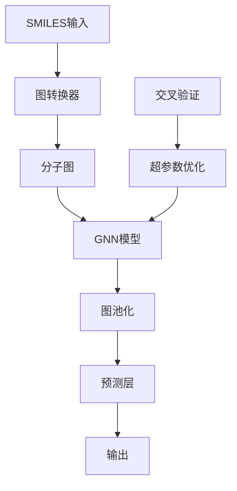

# CRAFT框架图神经网络(GNN)集成

## 概述

CRAFT框架现已集成图神经网络(Graph Neural Networks, GNNs)支持，可以直接处理SMILES字符串输入，无需手动特征工程。该集成提供了多种先进的GNN架构，包括GCN、GAT、MPNN、AFP、GTN等。

## 主要特性

### ✨ 核心功能
- **直接SMILES输入**: 无需预处理，直接输入SMILES字符串
- **自动图转换**: 自动将SMILES转换为丰富的分子图表示
- **多种GNN架构**: 支持6种不同的图神经网络模型
- **超参数优化**: 集成Optuna进行自动超参数调优
- **交叉验证**: 完整的CV支持和OOF预测
- **GPU加速**: 自动检测并使用GPU（如果可用）

### 🧠 支持的GNN模型

| 模型 | 描述 | 特点 |
|------|------|------|
| **GCN** | Graph Convolutional Network | 经典图卷积，适合基础图学习 |
| **GAT** | Graph Attention Network | 注意力机制，自动学习节点重要性 |
| **MPNN** | Message Passing Neural Network | 灵活的消息传递框架 |
| **AFP** | Attentive FP | 专为分子设计的注意力指纹 |
| **GTN** | 图Transformer架构 | 结合Transformer强大表达能力 |
| **Ensemble GNN** | 多模型集成 | 组合多个GNN模型提升性能 |

### 📊 图表示特征

**节点特征 (153维)**:
- 原子类型 (118种元素)
- 度数 (0-6)
- 形式电荷 (-3到+3)
- 杂化类型 (SP, SP2, SP3等)
- 氢原子数 (0-4)
- 价电子数 (0-6)
- 芳香性、成环性、原子质量

**边特征 (10维)**:
- 键类型 (单键、双键、三键、芳香键)
- 立体化学信息
- 共轭性、成环性

**分子级特征 (11维)**:
- 分子量、LogP、TPSA
- 旋转键数、环数、芳香环数等

## 快速开始

### 1. 安装依赖

```bash
# 激活CRAFT环境
conda activate craft

# 安装PyTorch Geometric及其依赖
pip install torch-geometric torch-scatter torch-sparse torch-cluster torch-spline-conv -f https://data.pyg.org/whl/torch-2.7.0+cpu.html
```

### 2. 配置文件示例

```yaml
# config_gnn_example.yaml
task_type: "regression"

data:
  source_mode: "single_file"
  single_file_config:
    main_file_path: "data/molecules.csv"
    smiles_col: ["reactant_smiles", "product_smiles"]
    target_col: "yield"

# 分子特征配置
features:
  molecular:
    reactant:
      is_feature_source: true
      smiles_column: "reactant_smiles"
    product:
      is_feature_source: true
      smiles_column: "product_smiles"

# GNN训练配置
training:
  models_to_run: ["gcn", "gat", "mpnn", "afp"]
  n_trials: 50
  cv_folds: 5

# 高级GNN设置
gnn_settings:
  max_epochs: 100
  early_stopping_patience: 15
  batch_size: 32
  device: "auto"  # 自动选择GPU/CPU
```

### 3. 运行训练

```bash
python run_training_only.py --config config_gnn_example.yaml
```

## 详细使用指南

### 配置参数说明

#### GNN模型参数
```yaml
training:
  models_to_run: 
    - "gcn"           # 图卷积网络
    - "gat"           # 图注意力网络  
    - "mpnn"          # 消息传递网络
    - "afp"           # 注意力指纹
    - "gtn"          # 图Transformer网络
    - "ensemble_gnn"  # 集成模型
  n_trials: 100       # 超参数优化试验次数
  cv_folds: 10        # 交叉验证折数
```

#### 高级设置
```yaml
gnn_settings:
  max_epochs: 200                    # 最大训练轮数
  early_stopping_patience: 20       # 早停等待轮数
  batch_size: 64                     # 批次大小
  device: "cuda"                     # 设备选择
```

### 超参数搜索空间

每个GNN模型都有优化的超参数搜索空间：

**通用参数**:
- `hidden_dim`: [64, 128, 256, 512]
- `num_layers`: [2, 3, 4, 5, 6]
- `dropout_rate`: [0.0, 0.5]
- `learning_rate`: [1e-5, 1e-2] (log scale)
- `optimizer`: ['adam', 'adamw', 'sgd']
- `scheduler`: ['plateau', 'cosine', 'none']

**模型特定参数**:
- **GAT**: `num_heads`, `attention_dropout`
- **MPNN**: `message_hidden_dim`, `num_message_steps`
- **AFP**: `num_timesteps`, `attention_hidden_dim`
- **GTN**: `num_heads`, `attention_dropout`

## 性能优化建议

### 📈 提升模型性能

1. **数据质量**:
   - 确保SMILES字符串有效且标准化
   - 移除重复或错误的分子结构
   - 平衡数据集分布

2. **模型选择**:
   - 小数据集: 使用GCN或GAT
   - 大数据集: 使用MPNN或GTN
   - 追求最佳性能: 使用Ensemble GNN

3. **超参数调优**:
   - 增加`n_trials`到100-200
   - 使用更多的`cv_folds`(5-10)
   - 调整`max_epochs`和`batch_size`

### ⚡ 计算效率

1. **GPU使用**:
   ```yaml
   gnn_settings:
     device: "cuda"
     batch_size: 128  # GPU上可以使用更大批次
   ```

2. **内存优化**:
   - 大分子数据集使用较小的`batch_size`
   - 设置合适的`max_nodes`限制

## 示例代码

### Python API使用

```python
from optimizers.gnn_optimizer import GNNOptimizer
from utils.smiles_to_graph import SmilesGraphConverter
import pandas as pd

# 准备数据
data = pd.DataFrame({
    'smiles': ['CCO', 'c1ccccc1', 'CC(=O)O'],
    'property': [0.5, 0.3, 0.2]
})

# 创建GNN优化器
optimizer = GNNOptimizer(
    model_name='gcn',
    smiles_columns=['smiles'],
    n_trials=50,
    cv=5,
    task_type='regression'
)

# 训练
X = data[['smiles']]
y = data['property'].values
optimizer.optimize(X_train, y_train, X_val, y_val)
optimizer.fit(X_train, y_train)

# 预测
predictions = optimizer.predict(X_test)
```

### SMILES图转换

```python
from utils.smiles_to_graph import SmilesGraphConverter

converter = SmilesGraphConverter()

# 转换单个SMILES
graph = converter.smiles_to_graph("CCO")
print(f"节点数: {graph.x.shape[0]}")
print(f"边数: {graph.edge_index.shape[1]}")

# 批量转换
graphs = converter.batch_smiles_to_graphs(['CCO', 'c1ccccc1'])
```

## 故障排除

### 常见问题

1. **ImportError: PyTorch Geometric not installed**
   ```bash
   pip install torch-geometric torch-scatter torch-sparse torch-cluster
   ```

2. **CUDA out of memory**
   - 减小`batch_size`
   - 减少`hidden_dim`
   - 使用CPU: `device: "cpu"`

3. **SMILES解析失败**
   - 检查SMILES字符串格式
   - 使用RDKit标准化SMILES
   - 过滤无效分子

4. **模型性能差**
   - 增加训练数据
   - 调整超参数搜索范围
   - 尝试不同的GNN架构
   - 使用集成模型

### 调试模式

```bash
# 运行测试套件
python test_gnn_integration.py

# 运行演示
python demo_gnn_workflow.py

# 详细日志
python run_training_only.py --config config.yaml --verbose
```

## 技术细节

### 架构设计



### 文件结构

```
craft/
├── utils/
│   └── smiles_to_graph.py     # SMILES到图转换
├── models/
│   └── gnn_models.py          # GNN模型定义
├── optimizers/
│   └── gnn_optimizer.py       # GNN优化器
├── core/
│   └── trainer_setup.py       # 集成到训练流程
├── config_gnn_demo.yaml       # 演示配置
├── demo_gnn_workflow.py       # 完整演示
└── test_gnn_integration.py    # 测试套件
```

## 扩展开发

### 添加新的GNN模型

1. 在`models/gnn_models.py`中添加模型类
2. 在`create_gnn_model`函数中注册
3. 在`optimizers/gnn_optimizer.py`中添加超参数定义
4. 更新配置文件和文档

### 自定义特征

```python
# 在SmilesGraphConverter中添加自定义特征
def _get_custom_atom_features(self, atom):
    features = self._get_atom_features(atom)
    # 添加自定义特征
    features.extend([
        float(atom.GetIsotope()),
        float(atom.GetRadicalElectrons())
    ])
    return features
```

## 性能基准

| 模型 | 参数量 | 训练时间 | 内存使用 | 适用场景 |
|------|--------|----------|----------|----------|
| GCN | ~20K | 快 | 低 | 基础分子性质 |
| GAT | ~25K | 中等 | 中等 | 需要注意力机制 |
| MPNN | ~90K | 较慢 | 高 | 复杂分子交互 |
| AFP | ~30K | 中等 | 中等 | 分子指纹学习 |
| GTN | ~40K | 慢 | 高 | 大规模数据 |
| Ensemble | 混合 | 最慢 | 最高 | 最佳性能 |

## 版本历史

- **v1.0.0**: 初始GNN集成
  - 支持6种GNN架构
  - 完整的超参数优化
  - SMILES自动图转换
  - GPU/CPU支持

## 贡献

欢迎贡献新的GNN架构、优化建议或错误修复。请遵循项目的编码规范和测试要求。

## 许可证

该GNN扩展遵循CRAFT框架的许可证条款。 